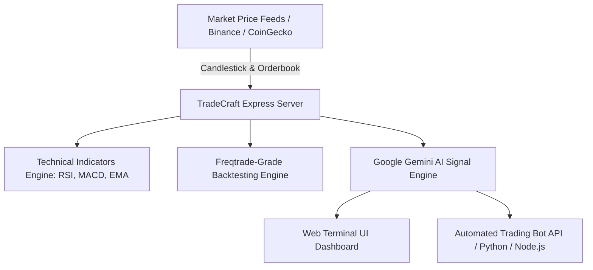

# 📈 TradeCraft AI Pro

<p align="center">
  
  =%2018.0.0-339933?style=for-the-badge&logo=node.js&logoColor=white" alt="Node version">
  
  
</p>

```txt
   ______               __     ______raft    ___   ____
  /_  __/______ _____  / /__  / ___/_______ / _ | /  _/
   / / / __/ _ `/ _  / / -_)/ /__/ __/ _ `/ __ |// /  
  /_/ /_/  \_,_/\_,_/_/\__/ \___/_/  \_,_/_/ |_/___/  
```

> **The Next-Gen Open-Source Real-Time Market Terminal, AI Trading Bot Engine, Freqtrade-Grade Backtester & Micro-Capital $20 Auto-Compounder.**

---

## 🏆 Feature Matrix (TradeCraft AI Pro vs Competitors)

| Feature | Freqtrade (28k★) | Hummingbot (10k★) | Superalgos (4k★) | **TradeCraft AI Pro (Ours)** |
| :--- | :---: | :---: | :---: | :---: |
| **Google Gemini AI LLM Signals** | ❌ No | ❌ No | ❌ No | ✅ **Built-in Gemini AI Core** |
| **$20 Micro-Capital Auto-Compounder** | ❌ No | ❌ No | ❌ No | ✅ **Built-in ($0.40 Risk Guard)** |
| **Freqtrade-Grade Backtester** | ✅ Yes | ⚠️ Complex | ⚠️ Complex | ✅ **Built-in Instant Engine** |
| **Orderbook Depth Visualizer** | ⚠️ Basic | ✅ Yes | ⚠️ Basic | ✅ **Real-Time Interactive Canvas** |
| **Zero-Config Glassmorphism Web UI** | ❌ Separate | ❌ CLI-only | ❌ Heavy 2GB App | ✅ **100% Web Terminal Ready** |
| **Auto-Trader Bot Execution Scripts** | ✅ Python | ✅ Python | ⚠️ Node Visual | ✅ **Python & Node.js Ready** |

---

## 💵 $20 Starter Capital Auto-Compounder Strategy

TradeCraft AI Pro features an algorithm specifically engineered for micro-accounts starting with **$20 starter capital**:

1. **Strict 2% Risk Allocation**: Every trade risks only $0.40 to $1.00 max, protecting small balances from volatility spikes.
2. **Automated Stop-Loss (SL) & Take-Profit (TP)**: Pre-calculated exit price levels automatically attached to every AI signal.
3. **Auto-Compound Growth Engine**: Profit reinvestment formula compounding small $20 accounts into $50, $100, $500+ systematically.
4. **Zero-Risk Paper Trading Simulator**: Test strategies live on historical and simulated market data without real money.

---

## ⚡ Quick Start

### 1. Clone & Install

```bash
git clone https://github.com/nafikfarel/tradecraft-ai.git
cd tradecraft-ai
npm install
```

### 2. Configure API Key

Copy environment file:
```bash
cp .env.example .env
```
Add your Google Gemini API Key in `.env`:
```env
PORT=3000
GEMINI_API_KEY=your_gemini_api_key_here
```

### 3. Run Web Terminal

```bash
npm run dev
```
Open **`http://localhost:3000`** in your browser 🚀

---

## 🤖 Running Automated Trading Bot Script

You can connect external automated trading bots to TradeCraft AI's `/api/v1/bot/signals` API endpoint:

### Python Auto-Trader Script (`scripts/bot_trader.py`):
```bash
python scripts/bot_trader.py
```

### Node.js Auto-Trader Script (`scripts/bot_trader.js`):
```bash
npm run bot:js
```

---

## 🏗️ Architecture



---

## 🤝 Contributing

Contributions are welcome! Check out [CONTRIBUTING.md](CONTRIBUTING.md) to submit pull requests for new indicators or exchange connectors.

---

## 📜 License

Distributed under the MIT License. See [`LICENSE`](LICENSE) for details.
